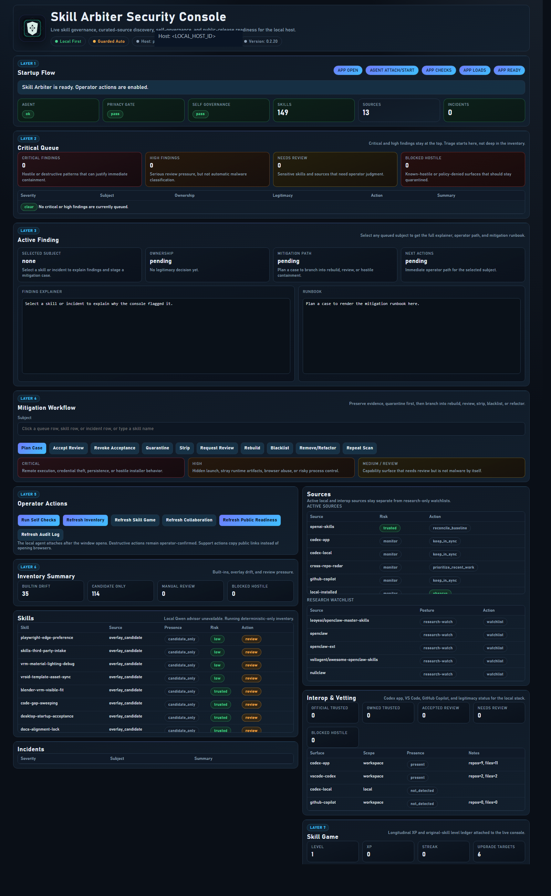

# skill-arbiter

[](LICENSE.txt)


`skill-arbiter` is a Windows-first NullClaw host security app for local skill governance, curated-source discovery, guarded threat suppression, and self-governance.

It started as an `rg.exe` churn moderator. It now acts as a capability firewall for local agent skills and related automation surfaces.

Local skill governance and threat suppression console with guarded operator actions, source legitimacy tracking, and operator-confirmed remediation.

## App preview

Public-safe preview capture from an isolated browser session:



## Reality check

The desktop app is not a fully self-sufficient operator product yet.

- Standalone desktop use still covers local inventory, baseline reconciliation, attribution, and mitigation.
- The app is only fully meaningful when real work is being driven through Codex or GitHub Copilot instruction surfaces.
- Without active Codex/Copilot-driven work, the interop view, collaboration lane, skill-game lane, and upgrade/consolidation recommendations become partial, stale, or much less useful.
- Do not describe the current app as a complete general-purpose skill-security console outside Codex/Copilot-driven workflows.

## AI warning

- Codex, GitHub Copilot, and other AI/agent systems can make mistakes.
- This app can surface useful governance and risk signals, but it does not turn AI output into ground truth.
- Operator review is still required before trusting destructive actions, provenance claims, upgrade advice, or security conclusions.
- If the app, agent, or upstream AI workflow disagrees with observed reality, treat that as a bug or mismatch to investigate, not proof that the machine is right.

## What it does

- Inventories installed skills under `$CODEX_HOME/skills`
- Reconciles built-in VS Code/Codex skills against the official `openai/skills` baseline
- Tracks `.system` skills, overlay candidates, curated third-party sources, and recent-work-relevant skills
- Scores high-risk patterns:
  - typosquats and fake installers
  - npm/npx/postinstall persistence
  - stale and untracked Python
  - vendored `python.exe` / `pythonw.exe`
  - hidden process launch
  - browser auto-launch abuse
  - credential prompt theft patterns
  - broad process-kill logic
  - tool/resource fan-out with remote execution surfaces
- Applies guarded local response:
  - admit
  - quarantine
  - disable
  - operator-confirmed delete / kill
- Audits itself with the same policy engine so the app does not become part of the problem
- Records collaboration outcomes and recommends governed skill creation, upgrades, or consolidation from real agent work

## Runtime model

- Desktop shell: embedded local UI via `pywebview`
- Agent: loopback-only Python server on `127.0.0.1:17665`
- Default policy mode: `guarded_auto`
- UI model: layered operator workflow with critical-first triage
- Loopback API state responses are served `no-store` so the embedded desktop cannot silently reuse stale inventory, skill-game, or collaboration data
- Full-value mode depends on active Codex or GitHub Copilot work feeding instruction-surface, collaboration, and skill-learning evidence
- Startup flow:
  1. app open
  2. agent attach/start
  3. self-checks
  4. inventory refresh
  5. operator actions enabled
- No external browser launch in the normal operator path

## Local advisor

The app uses a dedicated local coding-security LLM for short advisory notes.

Defaults:

- `NULLCLAW_AGENT_BASE_URL=http://127.0.0.1:9000/v1`
- `NULLCLAW_AGENT_MODEL=auto`
- `NULLCLAW_AGENT_ENABLE_LLM=1`

The advisor must remain local-only by default.

Model policy:

- Any loopback LM Studio coding-capable model is supported.
- Small local Qwen models remain the preferred default when available.
- If `NULLCLAW_AGENT_MODEL` is left as `auto`, the app prefers local Qwen/coder lanes and then falls back to another loopback coding model.

## Quick start

Install dependencies:

```bash
python -m pip install -r requirements.txt
```

Open the desktop app:

```bash
python scripts/nullclaw_desktop.py
```

Open the desktop app through the managed Windows launcher:

```powershell
powershell -ExecutionPolicy Bypass -File .\scripts\start_security_console.ps1
```

Install branded desktop and Start Menu shortcuts:

```powershell
powershell -ExecutionPolicy Bypass -File .\scripts\install_security_console_shortcut.ps1
```

The installed shortcuts use a silent `wscript` launcher so the console does not bounce through visible PowerShell or `cmd` wrappers.

Stop the desktop app and loopback agent cleanly:

```powershell
powershell -ExecutionPolicy Bypass -File .\scripts\stop_security_console.ps1
```

Run the agent headless:

```bash
python scripts/nullclaw_agent.py
```

Refresh the machine-generated catalog:

```bash
python scripts/generate_skill_catalog.py
```

Run the privacy gate:

```bash
python scripts/check_private_data_policy.py
```

Refresh the machine-generated vetting report:

```bash
python scripts/generate_skill_vetting_report.py
```

Run the public-release gate:

```bash
python scripts/check_public_release.py
```

## Local API

The desktop UI talks to a local-only loopback API:

- `GET /v1/health`
- `GET /v1/about`
- `POST /v1/self-checks/run`
- `GET /v1/privacy/status`
- `POST /v1/inventory/refresh`
- `GET /v1/inventory/skills`
- `GET /v1/inventory/sources`
- `GET /v1/incidents`
- `GET /v1/mitigation/cases`
- `POST /v1/mitigation/plan`
- `POST /v1/mitigation/execute`
- `GET /v1/collaboration/status`
- `POST /v1/collaboration/record`
- `GET /v1/public-readiness`
- `POST /v1/public-readiness/run`
- `POST /v1/admission/evaluate`
- `POST /v1/quarantine/apply`
- `POST /v1/actions/confirm`
- `GET /v1/audit-log`

## Inventory coverage

The live inventory pipeline covers:

- installed top-level skills
- installed `.system` skills
- overlay candidates under `skill-candidates/`
- official OpenAI upstream baseline from `openai/skills`
- local Codex config under `%USERPROFILE%\\.codex`
- Codex app, VS Code, and GitHub Copilot instruction surfaces across the local workspace
- curated third-party sources already tracked by the repo
- threat-matrix references for OpenClaw / NullClaw discovery surfaces
- recent-work relevance from cross-repo radar artifacts
- ownership and legitimacy scoring for official built-ins, repo-owned skills, candidates, and unowned local installs
- rejected third-party candidate stubs stay attributable in the repo references, but are kept out of the active live inventory until they are rebuilt or explicitly installed for review

What this does **not** mean:

- the desktop alone can infer meaningful collaboration history without Codex/Copilot-driven work
- the skill-game lane is useful without real governed agent work being recorded
- the interop surfaces prove much on their own beyond presence-level tracking unless Codex/Copilot workflows are actually active

See:

- [references/skill-catalog.md](references/skill-catalog.md)
- [references/skill-vetting-report.md](references/skill-vetting-report.md)
- [references/OPENCLAW_NULLCLAW_THREAT_MATRIX_2026-03-11.md](references/OPENCLAW_NULLCLAW_THREAT_MATRIX_2026-03-11.md)
- [references/vscode-skill-handling.md](references/vscode-skill-handling.md)

## Collaboration and skill learning

The console now records governed collaboration outcomes from real agent work and turns repeatable
patterns into actionable skill recommendations.

- These lanes are intentionally dependent on real Codex or GitHub Copilot-driven work. Without that input, the app still opens and inventories locally, but this section is only partially useful.
- collaboration events are stored in local-only state
- trust-ledger and skill-game lanes receive the same outcome evidence
- the skill-game now reports the original long-lived skill levels from `references/skill-progression.md`
- those original levels are a longitudinal progress ledger for the real skill estate, not a deprecated legacy-only display
- the desktop app can recommend whether a pattern should become a new skill, an upgrade, or a consolidation
- `heterogeneous-stack-validation` is the governed candidate lane for mixed local-plus-remote validation work like the current stack sweep
- The desktop shows section-local refresh failures in place instead of leaving zero/default placeholders that can look like data loss

## Usage reduction and local compute evidence

The cost and routing skills now consume loopback stack accounting evidence rather
than reasoning only from manual credit logs or static budgets.

- `usage-watcher`
- `local-compute-usage`
- `skill-cost-credit-governor`

These skills can now ingest and compare:

- `TPK`
- `authoritative_cost`
- `displacement_value_preview`
- `benchmark_api_equivalent_cost`
- `local_marginal`
- `cloud_equivalent`
- `savings vs cloud`
- routing/provider provenance
- local runtime latency and lane health

The key contract is dual-ledger:

- `authoritative_cost` remains strict billing truth
- `displacement_value_preview` remains benchmarked non-billing shadow value

That distinction is now a governed input to usage reduction, local-first routing,
and skill upgrade recommendations instead of a manual after-the-fact story.

## Mitigation workflow

The desktop app treats findings as live mitigation cases, not static warnings.

Operator flow inside the desktop app:

1. startup flow and host/agent state
2. critical queue with critical and high findings pinned at the top
3. active finding explainer and runbook
4. mitigation actions
5. inventory, sources, and interop review
6. privacy, release, support, and audit evidence

Default response chain:

1. preserve evidence
2. quarantine fast
3. strip suspicious artifacts
4. report the case
5. request review if the skill looks legitimate
6. rebuild clean from a trusted source when possible
7. blacklist if hostile
8. remove or refactor
9. audit threat vectors
10. audit sources
11. evaluate adjacent vectors
12. document the outcome
13. repeat the scan

Case planning now separates:

- `official_trusted`
- `owned_trusted`
- `needs_review`
- `blocked_hostile`

so the console can legitimize the local stack without pretending every dangerous capability is malware.

## Public-shape rule

This repository is public-shape only.

- Do not commit usernames, absolute private paths, private repo names, or raw host evidence.
- Repo-tracked docs and JSON stay placeholder-safe.
- Raw local evidence, audit events, and destructive-action records stay in ignored local state.

## Public support

Public support and project links surfaced by the desktop app:

- GitHub repo: `https://github.com/grtninja/skill-arbiter`
- GitHub issues: `https://github.com/grtninja/skill-arbiter/issues`
- GitHub security: `https://github.com/grtninja/skill-arbiter/security`
- Patreon: `https://www.patreon.com/cw/grtninja`

The desktop UI copies these links to the clipboard instead of opening external browsers automatically.

See also:

- [SUPPORT.md](SUPPORT.md)
- [CODE_OF_CONDUCT.md](CODE_OF_CONDUCT.md)

## Public release readiness

Before publishing or widening distribution:

1. Run `python scripts/check_private_data_policy.py`.
2. Run `python scripts/check_public_release.py`.
3. Confirm the desktop app shows a passing Public Release panel.
4. Confirm icon assets and shortcut installers are present.
5. Confirm repo-tracked files remain public-shape only.

## Safety and abuse handling

`skill-arbiter` is a defensive local-host security console.

- It is for quarantine, review, and remediation of risky skills and automation surfaces.
- It is not for persistence abuse, credential theft, remote compromise, or stealth operator bypass.
- Destructive actions stay operator-mediated or clearly audited in local-only state.
- Public docs and artifacts stay sanitized so the repository does not become a leak surface.

## Validation

```bash
python scripts/arbitrate_skills.py --help
python scripts/nullclaw_agent.py --help
python scripts/generate_skill_catalog.py
python scripts/generate_skill_vetting_report.py
python scripts/check_private_data_policy.py
python scripts/check_public_release.py
pytest -q
python -m py_compile scripts/arbitrate_skills.py scripts/check_private_data_policy.py scripts/check_public_release.py scripts/generate_skill_catalog.py scripts/generate_skill_vetting_report.py scripts/nullclaw_agent.py scripts/nullclaw_desktop.py skill_arbiter\\about.py skill_arbiter\\agent_server.py skill_arbiter\\inventory.py skill_arbiter\\llm_advisor.py skill_arbiter\\mitigation.py skill_arbiter\\privacy_policy.py skill_arbiter\\public_readiness.py skill_arbiter\\self_governance.py skill_arbiter\\threat_catalog.py
```

## Repository layout

- `skill_arbiter/`: runtime package for the local NullClaw agent
- `apps/nullclaw-desktop/ui/`: embedded desktop UI
- `scripts/`: entrypoints, generators, and governance utilities
- `skill-candidates/`: overlay skills and candidate skills
- `references/`: generated catalog plus policy/reference material
- `tests/`: regression coverage
- `docs/`: project scope and tracker

## Related docs

- [BOUNDARIES.md](BOUNDARIES.md)
- [SECURITY.md](SECURITY.md)
- [CONTRIBUTING.md](CONTRIBUTING.md)
- [SKILL.md](SKILL.md)
- [docs/PROJECT_SCOPE.md](docs/PROJECT_SCOPE.md)
- [docs/SCOPE_TRACKER.md](docs/SCOPE_TRACKER.md)
